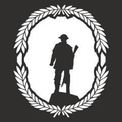
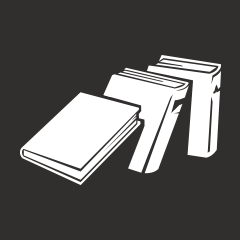

# [PS4] Battlefield 1

- [Opinions](#opinions)
- [Statistics](#statistics)
- [Trophies](#trophies)
- [Screenshots](#screenshots)
---
## Opinions  
I think the Battlefield series is an all-time best shooting game to play with/without friends. And I know that people hate when they try to compare COD and BF. But my opinion is, COD demands fast reflexes, precision, and experiences. On the other hand, BF 1 is more about moving as a team and try to capture objectives as a whole. It's literally impossible to survive solo because it's a 32v32 match.  Honestly, everytime I'm playing a match, I don't know half of what's going on around me. But that just makes the game more fun because you can't predict what might happen. And not to mention the campaign, it was impressive. Battlefield always offer such an immersive campaign. I have played BF4 and BF Hardline, and I'm always impressed with how much they put effort in not just multiplayer mode.  

## Statistics

## Trophies  
Getting the platinum in BF 1 was just as easy as getting it in other games in the series. And I find the difficulty in Battlefield not that hard even if it's on the hardest mode. So overall, completing the campaign in hard mode was easy. Every campaign has codex entries(challenges) to complete and Field Manuels to retrieve. Some challenges were hard but most of it was straight forward if you were looking up the strategies along the way. There were online trophies but it was simple and not time consuming. Here are the trophies and codex entries(challenges) that were somewhat hard/time consuming.  

**World War One Hero**  
 51
 1
 10
 9 
 31  

1.  
Master of Adaptation  
Some challenges were hard, I'll admit. But 80% of them were easy or you just had to go out of your way a little and complete a certain task. The checkpoint system really helped so you don't need to replay the level again and again(just be careful of the challenges the are located at the end of the chapters). If you just want to run through the challenges and get them out of your way, get your smartphone or computer and look at strategies on how to complete them. If you couldn't get it your first time, restart from checkpoint and try again. The challenges below are what took me some time. 

- German Anti-Tank Tactic (Storm of Steel: Over the Top)  
This one you have to watch out for the field guns throughtout the episode. There are 36 in total and you have to destroy every single one. Look up on the locations and try to keep count on how many you've destroyed. I recommend not dying so that the counter doesn't glitch. 

- Airborne Cannons (Friends in High Places: Forte Et Fidele)  
I believe this challenge is the hardest of all. It took me about 20 or 30 minutes to get this one. I found information that  indicates that the challenge difficulty had risen due to updates to the game. Apparantly, during the early stages, there weren't a lot of smoke when you've fired the stationary weapon. The stationary weapon didn't burn out as fast compared to the one before the update. It would be kind of easy if all of the aircrafts were programmed to fly in an exact route every time you play. But that's not the case. Even though the route in which they spawn into the field is programmed, the route after that makes this challenge tricky. Not only does precision make the key to completing this challenge but also some luck is required. You need to destroy 10 aircrafts in total in a matter of 30 seconds. The first 3 come directly in front of you. After that, the next group of 3 come from your right, through the clouds. If you have good aim, try to destroy 2 aircrafts that fly to your right, right above the direction where the 2nd group comes in. That's 8 in total. After you destroy the 2nd group, you have about 15 seconds to put down 2 more. That's if you didn't miss a single aircraft up to this point.  

2.  
Enough for a Library  

## Screenshots
