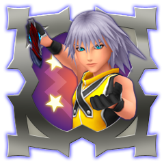

- [Opinions](#opinions)
- [Statistics](#statistics)
- [Trophies](#trophies) 
- [Screenshots](#screenshots)

---  

## Opinions  
Since the game is a remake for ps4, the game controls are smoother and the graphics are impressive compared to when it first came out on ps2. I haven't played this game since I was in middle school, so maybe around 7 years. But still, when I played the proud mode for my first play through on the remake version, I honestly didn't have a hard time completing it. Instead, I thought it wasn't hard enough. But overall, I enjoyed the story (some parts weren't kind of interesting but hey, you can't be choosy)and I believe that most people skip this game and go straight to KH2 after they play KH. I understand that this game isn't played that much because the name kind of tells that this game is a side story or not canon, and it has little or no connection to the main story line. For people who wants to see the full picture of the story line, they should play this game. By playing this game, I finally understood why Sora was sleeping in a crystal-like pod when Sora was introduced in KH2.
 
## Statistics  
### Sora  
Play time:
- Beginner mode: approx. 9 hours  
- Proud mode: approx. 28 hours  

### Riku  
Play time:
- Proude mode: approx. 16hours  
 

## Trophies  
Most trophies can be gained easily or automatically by playing the game until the end. There are some trophies that were kind of annoying and time consuming but overall easy. Here's the ranking list of the most trophies that were hard/time consuming.

1.  Level Master Riku    
Sora has a good special attack "Megaflare" which you learn at level 57. Basically spam that move in Destiny Island and you get a ton of exp. But, if you play as Riku, your decks are preset and you don't learn a special move that is a one hit blow to multiple enemies. Which means you have to kill every enemy, gain their exp and keep **GRINDING**. A good method is to go to Castle Oblivion, use the "Strong Initiative" room card. There will only be neoshadows and red nocturnes appearing in that room. Make sure to hit the enemy before going in battle, kill every enemy **except one!**, then escape the battle. That way the enemy respawns and you can fight it again. Still, it took me around 8 hours just to level up Riku from 40 to 99. My best advice that I can give to you is just keep at it. Someday you'll get to level 99.

1.  Card Master Sora  
The enemy cards are what made this trophy kind of annoying. If you want a certain type of enemy card, you have to defeat that enemy last in battle. So for example, if you want a Shadows enemy card, defeat every enemy except the Shadows. So at the end of the battle, there should only be one or more Shadows alive in battle. But here's the catch, it is said that the enemy cards drop rate is **about 5**%. GOOD LUCK!

1.  Undefeated  
Maybe it's not that difficult, especially if you're playing beginner mode. But I tried to get this and speed run the game(not skipping the cutscenes) on beginner mode because I didn't think I'll have a hard time even without leveling up Sora. So every time Sora leveled up, I chose to get me CP up. I only leveled my HP once. It went well up until the 2nd fight with Vexen. Basically at this point, you have to break their move every time they make a special attack. The next fight was with Larxene after the fight with Riku(for the millionth time). Her move was fast and deadly. You need to take advantage of the shortcuts to catch up with her moves. And finally of course, Marluxia. His 1st form is possible to defeat, but his 2nd form is the problem. I needed to break every single deadly special moves of Marluxia while looking for room to use my item cards. Every time Marluxia card-breaks my cards, the chance of me winning goes down. 
 

## Screenshots  

